# Describe records

See the [Create new upload](./create_new_upload.md) for an overview of creating a new upload. This section provides a detailed description of each field available in the deposit form:

- **[Resource types](#resource-types)** — Select the right resource type.
- **[Digital Object Identifier (DOI)](#digital-object-identifier-doi)** — Reserve a DOI for inclusion in files before publication.
- **[Titles](#titles)** — How to add a main title and additional titles.
- **[Publication date](#publication-date)** — Learn to use date ranges or imprecise dates.
- **[Creators](#creators)** — Learn how to add creators/authors for your record.
- **[Descriptions](#descriptions)** — Learn how to add abstracts and notes.
- **[Licenses and rights](#licenses-and-rights)** — Learn to choose a license for your record.
- **[Contributors](#contributors)** — Learn to add persons/organizations that do not appear in the citation.

## Resource types

The resource type field is a required field in the deposit form. The resource type is used to describe the nature of the files being shared and is important for the discoverability of your record.
<figure markdown="span">
    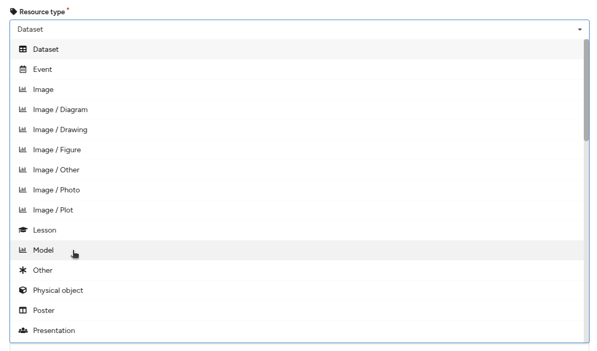{ loading=lazy }
  <figcaption>Login page</figcaption>
</figure>

## Selecting a resource type

1. From the resource type field drop-down, select one of the resource types that best describes the files you are sharing.
2. The selected resource type is important for the discoverability of your upload, both for users to find your research output and because various discovery systems only index, for example, publications, datasets, or software from the KTH Data Repository.

## Mixed resource types

You may find that you want to share a digital object that consists of, for example, both data and software, or any other combination of multiple resource types. In these cases, there are two possible solutions:

1. **Choose one type** – Select the resource type that you believe best describes and/or is most significant for the upload. For instance, the main contribution may be the dataset, while the software consists of a couple of processing scripts.
2. **Split the upload** – Divide the upload into multiple records, one per resource type. Choose this method when both, for example, the dataset and software are significant contributions in themselves.

## Digital Object Identifier (DOI)

A Digital Object Identifier (DOI) is a globally unique persistent identifier for your record. The DOI is important because:

- It provides a permanent link to your upload so readers can always reliably locate your content.
- It is important for discovery systems to attribute citations correctly.
- It enables reliable interlinking of research outputs.
- It makes your research more discoverable by indexing the DOI metadata in a global registry.

By default, the KTH Data Repository registers DOIs for all uploads when they are published. If you need to know the DOI before publication, you can use the method below to reserve a DOI. The reserved DOI can then be included in files (e.g., a text document) before uploading them.

## Reserve a DOI

1. In the **Digital Object Identifier** field, answer **"No"** to the question *"Do you already have a DOI for this upload?"*
      <figure markdown="span">
         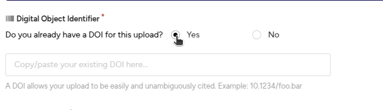{ loading=lazy }
      <figcaption>Already have a DOI</figcaption>
      </figure>
2. Click the **Get a DOI now!** button.
      <figure markdown="span">
         { loading=lazy }
      <figcaption>Get a new DOI</figcaption>
      </figure>
3. A DOI will now be reserved for you. You can include this DOI in files before uploading them (e.g., in a text document). You can also remove it by clicking the **X** button next to the DOI.
      <figure markdown="span">
         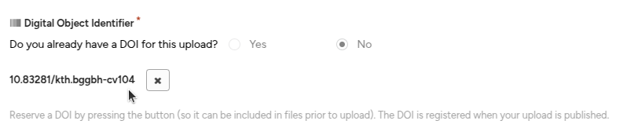{ loading=lazy }
      <figcaption>New DOI Generated</figcaption>
      </figure>

If you remove the reserved DOI, you can retrieve the same reserved DOI again by clicking the **Get DOI** button. However, if you delete the draft upload, the reserved DOI is lost.

## Use an existing DOI

If you have already shared or uploaded your record to another repository or journal, you may already have a DOI. In this case, you must provide the existing DOI to prevent multiple DOIs being registered for the same content. Note that if you are sharing supplementary data for a journal article, you should **not** use the journal article DOI.

1. In the **Digital Object Identifier** field, answer **"Yes"** to the question *"Do you already have a DOI for this upload?"*
      <figure markdown="span">
         { loading=lazy }
      <figcaption>Already have a DOI</figcaption>
      </figure>
2. Copy and paste (to avoid typos) the existing DOI into the field. The DOI will be validated for conformity, and a given DOI may only be deposited once in the KTH Data Repository (i.e., duplicate detection is in place).

## Titles

The title field is a required field in the deposit form. The title is essential for readers to discover your research, and it is used in citations and when records are displayed anywhere in the repository.

You may optionally add additional titles, such as subtitles, translated titles, or alternative titles.

## Add an additional title

1. Click the **Add titles** button.

      <figure markdown="span">
         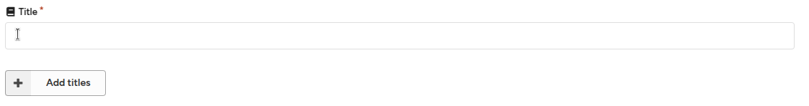{ loading=lazy }
            <figcaption>Add title text input</figcaption>
      </figure>
2. Provide the additional title and select the title type (*alternative title, subtitle, translated title, or other*).
      <figure markdown="span">
         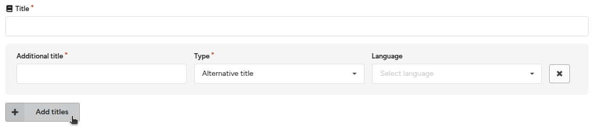{ loading=lazy }
            <figcaption>Add additional title</figcaption>
      </figure>
3. Optionally, set the language of the additional title.

## Publication date

The **publication date** field is a required field. By default, it is set to the date the draft was created. If your upload was previously published elsewhere (e.g., as a journal article), please use the date of the first publication.

Note that in addition to the publication date, the KTH Data Repository keeps track of the date a record was uploaded to the repository.

## Imprecise dates (EDTF)

For older content, you may not always know the precise publication date. In these cases, you can use both imprecise dates and date ranges following the **[Extended Date Time Format](https://www.loc.gov/standards/datetime/) (EDTF) Level 1** standard:

1. **Reduced precision for year and month** – `2025-09` refers to the month of September 2025.
2. **Reduced precision for year** – `2025` refers to the calendar year 2025.
3. **Time interval** – `2025-01-01/2025-09-23` refers to the time interval beginning on January 1, 2025, and ending on September 23, 2025.
4. **Time interval imprecise** – `1939/1945` refers to the time interval beginning sometime in 1939 and ending sometime in 1945.

## Creators

The **creators** field is a required field. Creators are the persons or organizations that have created the resource being uploaded (e.g., the authors in the case of papers). Creators are listed in the academic citation.

A creator can be either a:

- **Person**
- **Organisation**

See also [contributors](#contributors) for how to add persons or organizations that should not appear in the academic citation.

## Add a creator

1. Click **Add creator** to add one or more new creators.
      <figure markdown="span">
         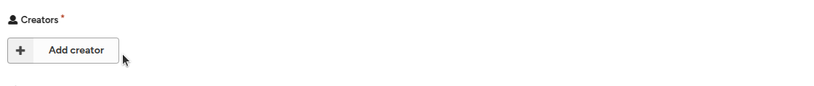{ loading=lazy }
            <figcaption>Add creator button</figcaption>
      </figure>
2. Choose between **Person** or **Organisation** as the name type.
      - **Person names** are split into family/given name fields and can be auto-completed.
      - **Organisation names** consist of a single name field and cannot be auto-completed.
      <figure markdown="span">
         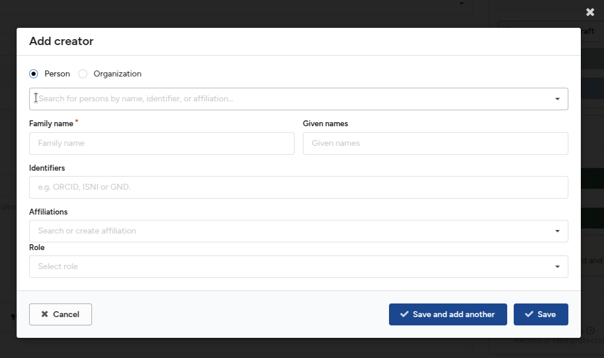{ loading=lazy }
            <figcaption>Add creator menu</figcaption>
      </figure>
3. Search for an already known person to speed up entry. The search is powered by the ORCID dataset.
      <figure markdown="span">
         { loading=lazy }
            <figcaption>Add creator autocomplete</figcaption>
      </figure>
4. Enter the **family name** and **given names**. The split is important for the automatic generation of citation strings.
5. Enter **name identifiers** for the person/organisation, such as ORCIDs, ISNIs, GNDs, or RORs. These will be automatically normalized by the form.
6. Enter one or more **affiliations** for the creator. The field is auto-completed from the ROR database.
      - Prefer selecting an auto-completed option as it uniquely identifies the organisation.
      - If your organisation is not listed, you may enter the name manually.
      <figure markdown="span">
         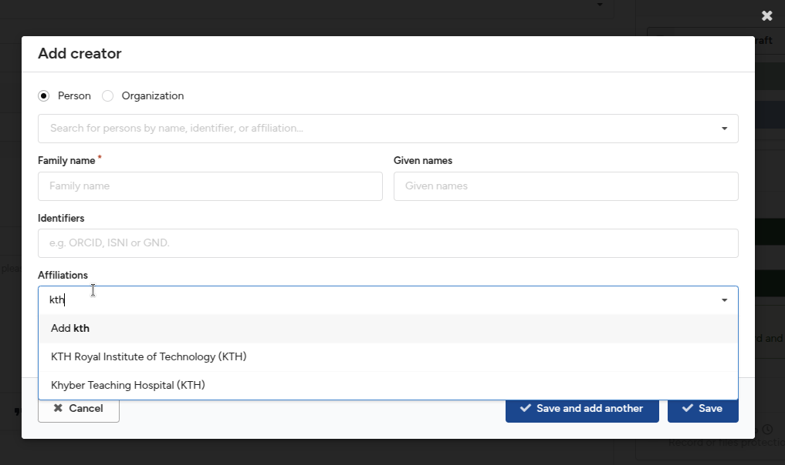{ loading=lazy }
            <figcaption>Add affiliation</figcaption>
      </figure>
7. Optionally, select a **role** for the creator (e.g., "Editor").
8. Click **Save and add another** to add more creators, or click **Save** to return to the main form.

## Edit a creator

1. Click the **Edit** button next to a creator to update their information.
      <figure markdown="span">
         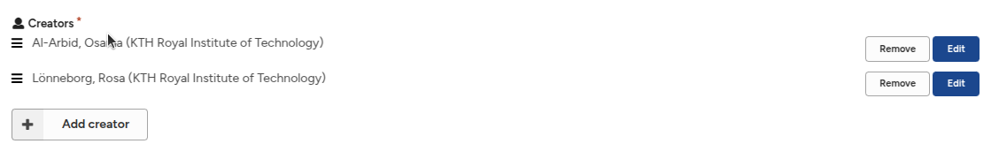{ loading=lazy }
            <figcaption>Edit creators</figcaption>
      </figure>

## Remove a creator

1. Click the **Remove** button next to a creator to delete them from the list.
      <figure markdown="span">
         { loading=lazy }
            <figcaption>Remove creators</figcaption>
      </figure>

## Reorder creators

1. Click and hold the **drag-and-drop icon**.
2. Drag the creator into the desired order in the list.
      <figure markdown="span">
         { loading=lazy }
            <figcaption>Reorder creators</figcaption>
      </figure>

## Descriptions

The **description** field is a recommended field. It is typically used to provide an abstract of your record. Additionally, you can add other descriptions, such as methods, technical information, and notes.

## Add a description

1. Enter an **abstract** for your record.
   - You may use basic formatting, including:
      - Paragraphs
      - Headings
      - Bold/italic text
      - Links
      - Bullet lists
      - Quotes

## Add an additional description (e.g., notes, methods)

1. Click the **Add description** button to add an additional description.
2. Fill in the additional description.
      - You can remove the description by clicking the **remove icon (X)**.
      <figure markdown="span">
         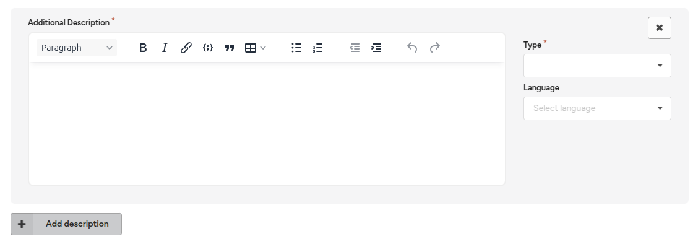{ loading=lazy }
            <figcaption>additional description menu</figcaption>
      </figure>
3. Choose a **description type**, and optionally, select the **language** of the description.
      <figure markdown="span">
         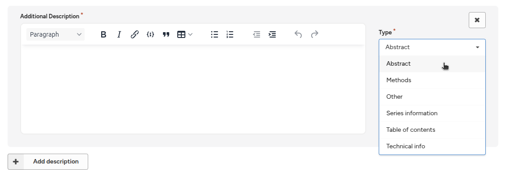{ loading=lazy }
            <figcaption>additional description types</figcaption>
      </figure>

## Licenses and rights

The **license** field is a required field. Providing a license for your record is important to allow other users to reuse your upload. The KTH Data Repository defaults to the **Creative Commons Attribution 4.0 International (CC-BY)** license.

## Choosing a license

We recommend the following resources to help you choose an appropriate license:

- [choosealicense.com](https://choosealicense.com/) – Useful especially for software.
- [OpenAIRE Guide for Researchers](https://www.openaire.eu/) – Useful especially for research data.

Once you have chosen a license, follow the steps below to select it in the KTH Data Repository.

## Change a standard license

1. Click the **Edit** button next to the **Creative Commons Attribution 4.0 International (CC-BY)** license.
2. Choose one of the widely recommended licenses presented, or search/browse for a standard license.
   - The KTH Data Repository relies on the widely used **[SPDX](https://spdx.org/licenses/)** list of licenses.
   - If you cannot find your license, you can add a **custom license** (see next section).

## Add a custom license

If you cannot find a standard license, you can add a custom license.

1. Click the **Add custom** button.
2. Provide the **title** of the license, and optionally, add a **description** and a **link** to the license.

## Mixed license uploads

You may need to upload files that fall under different licenses (e.g., software under the **MIT** license, but documentation under the **CC-BY** license). In such cases, you can declare all the applicable licenses in the system.

## Contributors

The **contributors** field is a recommended field. Use this field to provide information about persons or organisations that have contributed to the record, such as **supervisors, contact persons, sponsors**, etc. Contributors are **not** included in the academic citation.

## Creators vs. Contributors

The main difference between **creators** and **contributors** is summarized in the table below:

| | Included in citation | Role required |
|------------------|-----|-----|
| **Creators**     | Yes | No  |
| **Contributors** | No  | Yes |

You should decide where to add a person or organization based on whether they should appear in the academic citation.

## Add a contributor

1. Click the **Add contributor** button to add one or more contributors.
2. Fill in the contributors' information, similar to **creators** (see [Creators documentation](#creators)).
3. Choose the **role** for your contributor.
   - The list of roles is based on **[DataCite's contributor vocabulary](https://schema.datacite.org/)**.
4. Click **Save** or **Save and add another**.
