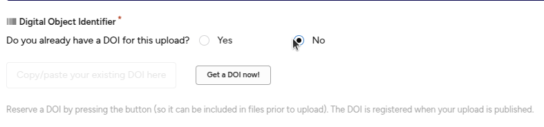

# Getting a DOI for your data

When you describe your data in KTH Data repository, you can also get a DOI - a digital object identifier that points to it. A DOI is a persistent identifier for your data - a more reliable type of link that will not change as long as your data is avaialable in KTH Data Repository.

If your data already have a DOI (typically because you have already submitted it to a different data repository), you should not get a new DOI for your data. Keep using the already existing DOI.

## How to get a DOI
When you describe your data in KTH Data Repository, you get to choose if you already have a DOI, or if you want a DOI. 

![assets/images/doi-yes.png]

If you need a DOI, mark that you don't have a DOI. You will now get the option to generate a DOI. The DOI will be pre-registered as soon as you click this option. When you publish your dataset, this becomes a valid DOI.

*Please note! DO NOT generate a DOI for a dataset if even title and description should remain confidential. Generating a DOI will send metadata to DataCite as part of the creation of the DOI. If you want to keep your metadata restricted, please avoid creating a DOI.* 

## How to pre-register a DOI

To pre-register a DOI, you click "Get a DOI now!" as above, but don't make your dataset public. The DOI is valid, and you can use it e. g. when submitting an article. However, if the dataset isn't yet published, you may also need to add a secret link for reviewer access to the data. If there is no separate field to add this information, just explain in your cover letter that the DOI is pre-registered, and add the link that reviewers should use. 

To generate a link for reviewer access to the data before you publish the (meta)data, you can [create a secret link as described here](share_record_access.md)

If you need your description to remain confidential, you should not yet pre-register a DOI. Pre-registering a DOI will send the title and some other metadata to DataCite. You can still share a secret link for reviewers. 

## When should you not register or pre-register a DOI for your data?

You should only create or pre-register a DOI when you intend to make the metadata post publicly available. If you want to pre-register a DOI for a dataset, but wait with making the metadata public, that's OK. But if you intend to keep the description of the data confidential, do not create or pre-register a DOI. 

Creating a DOI, or even pre-registration of a DOI means that some information about your dataset is sent to DataCite, the organisation that creates and keeps track of the DOI:s used in KTH Data Repository. If even the description of your data should stay confidential, don't create or pre-register a DOI.

