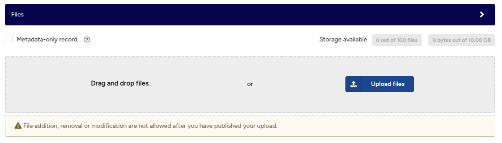

# Manage Files

!!! warning "**Heads up**"
     You CANNOT modify files after your record is published. Instead, use versioning.

The following sections document how to manage files for a draft and record. By default, you can upload up to 100 files with a total volume of 50GB (50,000,000,000 bytes).

## Prepare Files

We support file uploads up to 50GB (50,000 MB) and a maximum of 100 files. See how to request a quota increase.

When preparing files for upload, consider the following:

- **20+ files:** We recommend packaging them in a ZIP archive.
- **Hidden files:** ZIP archives may contain hidden files such as `__MACOSX`, `.DS_Store`, or `Thumbs.db`. See Stack Overflow and Microsoft guides for removal.
- **No changes:** You CANNOT modify files after your record is published.
- **Use open, non-proprietary formats:** For preservation-friendly formats, see:
  - [Digital Preservation Handbook - File formats and standards](https://www.dpconline.org/handbook/technical-solutions-and-tools/file-formats-and-standards)
  - [Library of Congress recommended format specifications](https://www.loc.gov/preservation/resources/rfs/index.html)

## Add Files

1. Drag and drop files or click **Upload files** to select one or more files.
        <figure markdown="span">
        { loading=lazy }
        <figcaption>Add Files</figcaption>
        </figure>
2. Large file uploads can be canceled while in progress by pressing the **Cancel** button.
    <figure markdown="span">
        { loading=lazy }
        <figcaption>Uploading files</figcaption>
    </figure>

## Remove Files

1. Click the **-** icon to remove an uploaded file.
    <figure markdown="span">
    { loading=lazy }
    <figcaption>Delete upload</figcaption>
    </figure>

## Set the Default Preview

1. By default, the first previewable file in alphanumeric order is displayed on your record's landing page.
2. To change the default preview file, check the checkbox in the **Preview** column.
    <figure markdown="span">
    { loading=lazy }
    <figcaption>File preview</figcaption>
    </figure>

## Pending State

A file may display the **Pending** state in the **Progress** column. This means the file upload is still in progress. Possible causes include:

- Uploading from a different browser window or by another user (multiple users can edit a draft).
- A broken upload followed by a page reload.

If an upload is interrupted, follow the **Remove file** instructions to resolve the issue.
    <figure markdown="span">
    { loading=lazy }
    <figcaption>File pending</figcaption>
    </figure>

## Modify Files After Publication

Once published, files CANNOT be added, removed, or modified. Instead, create a new version of the record using versioning.

A **one-month grace period** allows file modifications if errors are found. After this period, changes are only permitted in justified cases (e.g., copyright infringement, exposure of personal data). All modification requests must be submitted to support, but versioning is the preferred approach.

## Quota Increase

We exceptionally grant a **one-time quota increase** of up to **200GB** for datasets.

## Request a Quota Increase

1. Ensure that your request does not exceed **200GB (200,000 MB)** and contains fewer than **100 files**.
2. Log in to your account and create a new **draft record** (do not publish). See [Create a record](./create_new_upload.md) for details. Provide as much metadata as possible, including:
    - **Title**
    - **Description**
    - **Creators/Authors** (with affiliations)
    - **Related works** (especially peer-reviewed papers)
    - **License**
    - **Funding information**
3. Copy the browser URL, which should look similar to:
   `https://datarepository.kth.se/uploads/1235`
4. Send an email to **<researchdata@kth.se>** with the subject **File upload quota increase**. Include the following details in your request:
    - The **URL** copied in step 3.
    - The **total size** of your dataset (in GB, not GiB; e.g., 200GB = 200,000 MB).
    - Additional **information** (not already in the draft metadata) about the **organization, project, or grant** involved in the research, as well as any related or future papers citing this dataset (if applicable).
