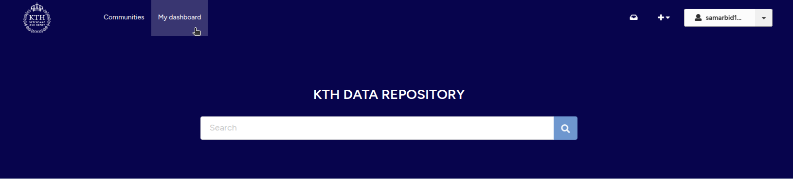
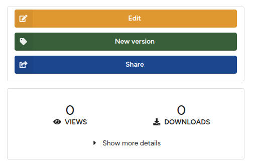
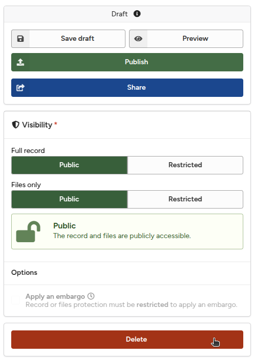

# Manage Records

The following sections describe how to browse your records, edit metadata, and delete records.

## Browse Your Records

1. To browse your uploads, click the **My dashboard** header menu. This will display the list of records you have uploaded by default.
        <figure markdown="span">
        { loading=lazy }
        <figcaption>Browse your records</figcaption>
        </figure>
2. From the **My Uploads** tab, you can view both your published and unpublished records.
3. You can **view or edit** each record. See below for details.

## Edit Published Records

You can edit the **metadata** (title, creators, etc.) of a published record at any time. However, **files in the record cannot be modified** (added, deleted, or changed) after publication. See [Manage Files](./manage_files.md) and [Manage Versions](./manage_versions.md) for more details.

1. To edit a record, click the **Edit** button under **My Uploads** (see above).
2. Alternatively, you can also click the **Edit** button from the record's landing page.
        <figure markdown="span">
        { loading=lazy }
        <figcaption>Edit record</figcaption>
        </figure>

## Delete Records

You can **only delete an unpublished record**. Published records cannot be deleted except under special circumstances. If necessary, please submit a request via our support line.

1. To delete an unpublished record, first **edit** the record (see above).
2. From the **deposit form**, click the red **Delete** button.
        <figure markdown="span">
        { loading=lazy }
        <figcaption>Delete record</figcaption>
        </figure>
