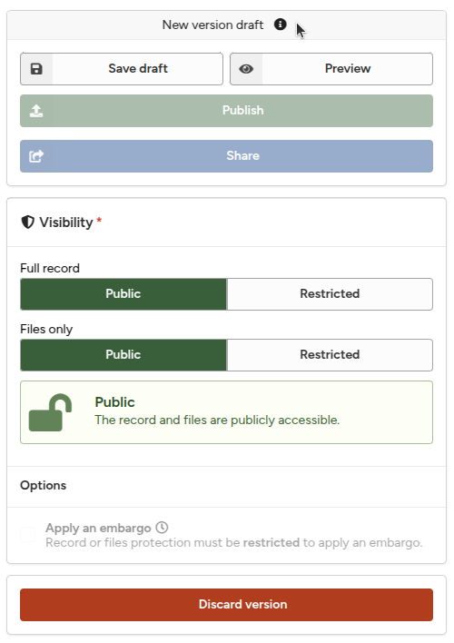
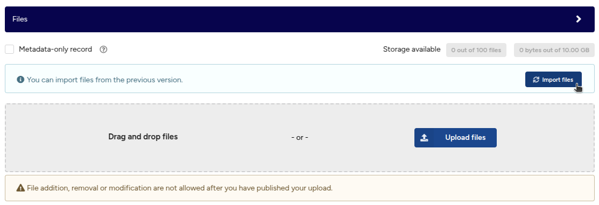
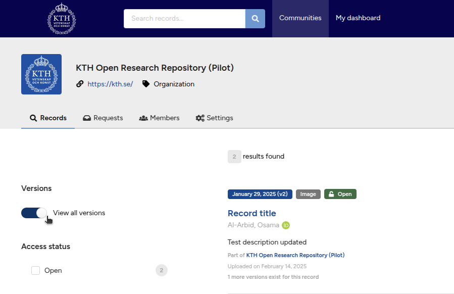

# Manage versions

The following sections describe how you can create a new version of a record, import files from a previous version, browse versions, and edit previous versions.

## When to use versioning?

Versioning is used if you need to add, remove, or modify files in your published record. If you only need to edit metadata (title, creators, description, etc.), see [Edit published records](./manage_records.md#edit-published-records).

Read more about versioning in [About records](./about_records.md).

## The section covers

- Create a new version
- Import files from a previous version
- Browse versions
- Edit metadata of a previous version

### Create a new version

1. Go to the record landing page of the record you want to create a new version of.
2. Click the green **New version** button to create a new version draft. The button is only displayed if you have permissions to edit the record.
        <figure markdown="span">
        { loading=lazy }
        <figcaption>New version</figcaption>
        </figure>
3. The deposit form will now show that you're editing a **New version draft**. Fill in the metadata and upload files as for any other record.
        <figure markdown="span">
        { loading=lazy }
        <figcaption>New version draft</figcaption>
        </figure>

### Import files from a previous version

1. In the **Files** section of the deposit form, click the **Import files** button to import files from a previous version. Using this feature saves storage space as we don't duplicate the previous files.
        <figure markdown="span">
        { loading=lazy }
        <figcaption>New version import files</figcaption>
        </figure>
2. You can now add, remove, or modify the imported files as described in [Manage files](./manage_files.md).

### Browse versions

1. Go to **My uploads**.
2. Toggle the **View all versions** switch to **on**. You can now browse and search all previous versions of a record.
        <figure markdown="span">
        { loading=lazy }
        <figcaption>Browse versions</figcaption>
        </figure>

### Edit metadata of a previous version

1. Find the previous version you want to edit using, e.g., **Browse versions**.
2. Click the **Edit** button to edit the previous version (see [Edit published records](./manage_records.md#edit-published-records)).
