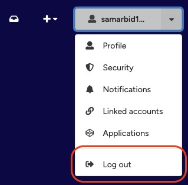

# Logging in and logging out

## Log in

1. Click the white **Log in** button in the header.

2. Choose your preferred method to log in depending on how you created your account.

## Log out

1. Click the down-arrow button on your username in the header to open the drop-down menu.

<figure markdown="span">
    { loading=lazy, width="400" }
  <figcaption>Logout button</figcaption>
</figure>
2. Click **Log out** to log out of the KTH Data Repository.
3. You will now have been logged out of the current device you are using. If you logged in from other devices, these may still be logged in. Learn how to view [logged in devices](viewing-devices.md).
