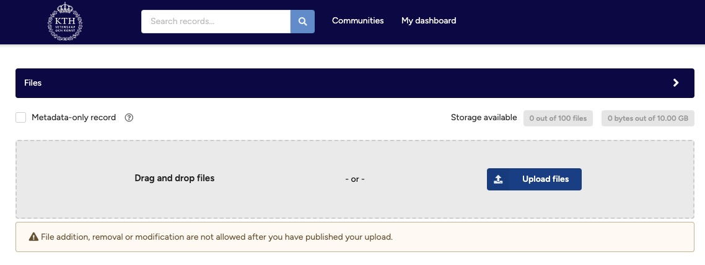
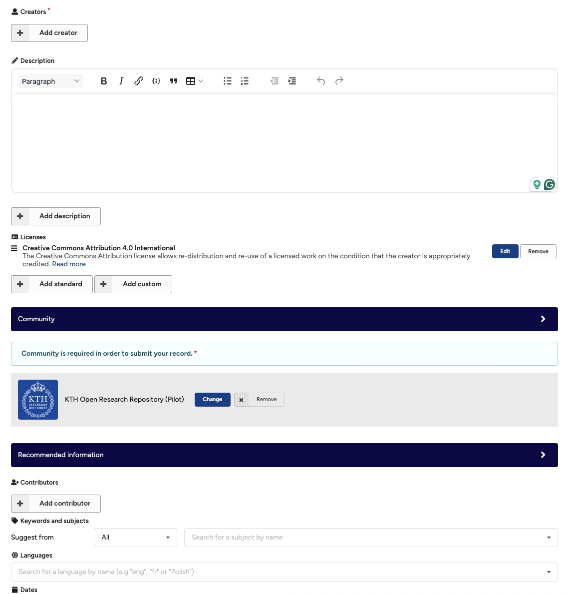
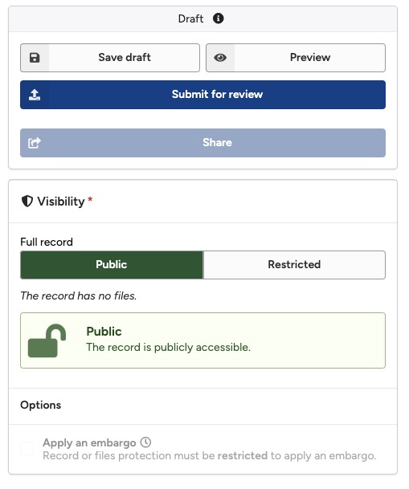

# Quick Start

Want to test KTH Data Repository? Use our [sandbox environment](https://invenio-dev.kth-prod-1.sys.kth.se){:target="_blank"} to play.

KTH Data Repository enables you to share and preserve your digital research objects (publications, data, software, presentations, etc.) in three simple steps:

## Step 1: Upload

Upload the files you want to share.

1. Before you start, make sure you have created an account and logged in.
2. Click the plus icon in the header, and select **New upload**.
        <figure markdown="span">
            { loading=lazy }
        <figcaption>Upload button</figcaption>
        </figure>
3. Upload one or more files by clicking the **Upload files** button to select files from your computer. Note that you will not be able to add, remove or modify files once published.
        <figure markdown="span">
            { loading=lazy }
        <figcaption>Upload section</figcaption>
        </figure>
## Step 2: Describe

Describe the files with metadata such as title and creators.

1. Fill in the required fields (marked with a red star).
        <figure markdown="span">
            { loading=lazy }
        <figcaption>Describe record</figcaption>
        </figure>
2. Click **Save draft** to validate the provided information.
        <figure markdown="span">
            { loading=lazy }
        <figcaption>Save draft button</figcaption>
        </figure>

## Step 3: Submit for review

1. When ready, press the **Submit for review** button.
2. Your submission will be reviewed by a curator. see [Submit for review](../share/submit_for_review.md)
        <figure markdown="span">
            { loading=lazy}
        <figcaption>Submit for review button</figcaption>
        </figure>
3. Once approved, your record will be published and a Digital Object Identifier (DOI) will be assigned.
4. Congratulations, you have now submitted your first record for review.

!!! warning ATTENTION
    Once you publish, we will automatically assign a Digital Object Identifier (DOI) to your record.

    You will not be able to add, modify or remove files from the record once published

