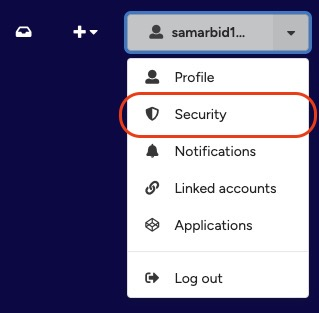
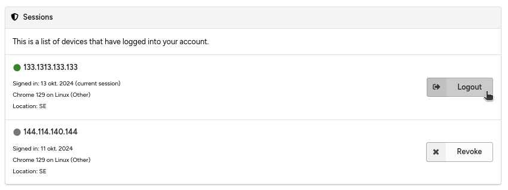

# View logged in devices

!!! warning
    If you think your account may have been compromised, please <a href="mailto:it-support@kth.se" target="_blank">contact us immediately</a>.

If you authenticate from multiple devices to your KTH Data Repository account, you'll be able to see all the devices that are logged into your account.

The information you see in the overview, such as IP address, login date, browser, and operating system, is only stored while your authenticated session is active, and if you don't log out, it is automatically deleted after 30 days. See our privacy policy.

In the following section, you can learn:

- Viewing logged in devices
- Logging out from another device

## Viewing logged in devices

1. Click the profile menu in the header and select **Security**.

<figure markdown="span">
    { loading=lazy, width="400" }
  <figcaption>Security menu</figcaption>
</figure>
2. Under **Sessions**, you will see all devices logged into your account, including their IP address, date of login, and browser. Your current device is marked with a green dot, and the button says **Logout**.
<figure markdown="span">
    { loading=lazy, width="700" }
  <figcaption>Sessions</figcaption>
</figure>

## Logging out from another device

Use this method if, for example, you forgot to log out from a device and don't have the device readily accessible. If you want to log out from your current device, see how to log out.

1. Find the device from the list of devices (see viewing logged in devices).

2. Click the **Revoke** button to log out the device. If the button says **Logout**, it means it's the authenticated session for your current device.
