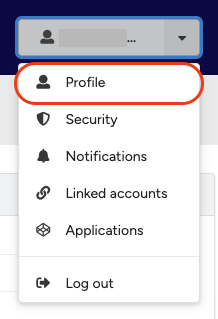

## Change profile visibility

Your profile visibility controls who can find you on the KTH Data Repository. You can set the visibility of the following:

- **Profile**: Public profiles can be found by other users via searches using your username, full name, or affiliation. Hidden profiles cannot be found by other users.
- **Email**: Making your email public allows your profile to be discoverable via your email address.

By default, your email visibility is set to **hidden** when you create an account, for privacy reasons.

### Change your profile visibility

1. Click the **Profile** menu in the header and select **Profile**.

<figure markdown="span">
{ loading=lazy }
<figcaption>Click Profile in the dropdown menu</figcaption>
</figure>

2. Under **Preferences**, change your profile and email visibility to either **public** or **hidden**.

<figure markdown="span">
{ loading=lazy }
<figcaption>Profile and email visibility settings</figcaption>
</figure>

3. Click **Update preferences** to save your changes.
