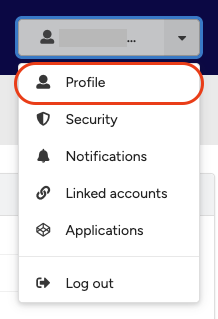
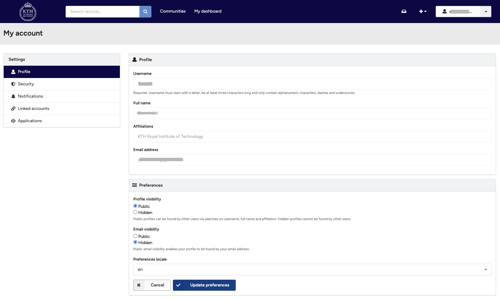
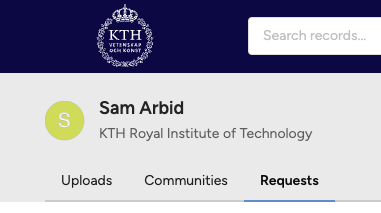

## Edit profile

You cannot manage your full name and affiliations from the profile page. The username and email address are automatically taken from the service you logged in with and cannot be changed after registration.

<figure markdown="span">
    { loading=lazy }
  <figcaption>Profile menu</figcaption>
</figure>

<figure markdown="span">
    { loading=lazy }
  <figcaption>Profile page</figcaption>
</figure>

### Viewing your profile

You can view your updated profile e.g. on My dashboard.

### Change avatar

The avatar (the round logo next to your name) is currently automatically generated based on assigning a random colour from a palette and determining a start letter. We hope to in future versions to allow you to change your avatar, but currently it is not possible.

<figure markdown="span">
    { loading=lazy }
  <figcaption>Avatar icon</figcaption>
</figure>

### Manage who can see my profile

Please refer to change profile visibility.
