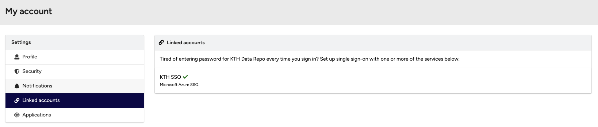
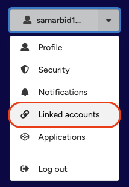
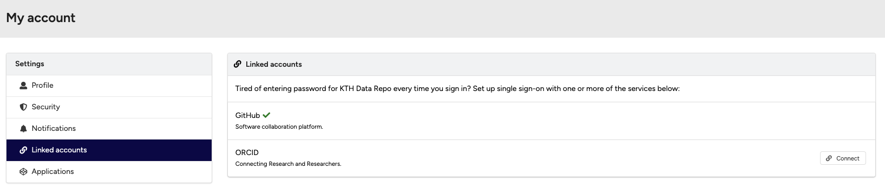

# Linking your GitHub or ORCID account

If you don't already have an account, see the section **Create an account** to learn how to sign up using GitHub or ORCID. The signup process will automatically link the external account you use.

The KTH Data Repository allows you to log in with an external account. The following authentication providers are supported:

- **GitHub**: Linking your GitHub account enables you to automatically archive your GitHub repositories via our GitHub integration.
- **ORCID**: Enables you to log in with your ORCID account and associate your ORCID with your KTH Data Repository account.
!!! note
    **Please note:** If you log in using SSO, you will **not** be able to link your account to an author profile (GitHub or ORCID).

<figure markdown="span">
{ loading=lazy }
<figcaption>Example of linked accounts page with SSO connection established</figcaption>
</figure>

## Connect an external account

1. Click the **Profile** menu in the header and select **Linked accounts**.

<figure markdown="span">
{ loading=lazy }
<figcaption>Profile menu showing Linked accounts option</figcaption>
</figure>
2. Click the **Connect** button next to the service provider you want to connect (GitHub or ORCID).

<figure markdown="span">
{ loading=lazy }
<figcaption>Linked accounts page showing GitHub and ORCID connection options</figcaption>
</figure>
3. You will be redirected to the selected service provider to authenticate. Once successful, you will be redirected back to the KTH Data Repository.
4. If the linking is successful, a green check mark will appear next to the connected service (e.g. GitHub). You will now be able to log in to the KTH Data Repository using this external account.

## Disconnect an external account

1. Click the **Profile** menu in the header and select **Linked accounts**.
2. Click the **Disconnect** button next to the service provider you want to unlink.

!!! note
    To see disconnect options for both services, connect both your GitHub and ORCID accounts. At least one external account (GitHub or ORCID) must remain connected at all times.