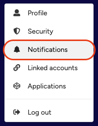
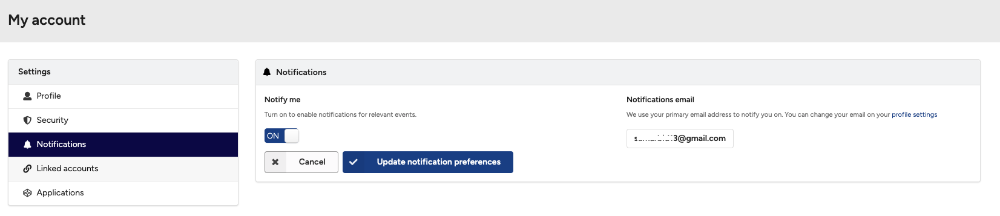

## Manage notification preferences

The KTH Data Repository sends notification emails, for example, when a record is submitted to your community or when you are invited to join a community. You can choose to turn these notifications on or off if you do not wish to receive them.

Notification emails are sent to the email address registered with your KTH Data Repository account.

### Change notification preferences

1. Click the **Profile** menu in the header and select **Notifications**.

<figure markdown="span">
{ loading=lazy }
<figcaption>Profile menu with Notifications option</figcaption>
</figure>

2. Under **Notify me**, toggle the switch to either **on** or **off** depending on whether you want to receive notifications.

<figure markdown="span">
{ loading=lazy }
<figcaption>Notification preferences settings</figcaption>
</figure>
