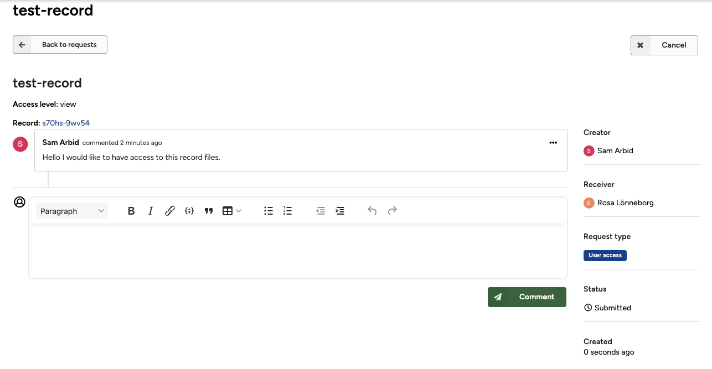

Access requests enable other users and guests to request access to view restricted files in your published record (e.g. anonymised clinical trial data that can only be shared with medical professionals).

## Request access

Users and guests can request access to restricted files in your record. As the record owner, you will receive a notification and can choose to approve or deny the request.

### Allow access requests

You can enable access requests for your restricted files. When enabled, users will see an option to request access, and you will be notified when a request is made.

## Request access

The following sections explain how to request access to restricted files in a record. The owner of the record can choose who is able to request access (one or both of):

- **Guests** – will be granted access via a secret link that expires after a duration defined by the owner.
- **Users** – will be granted permanent access via their user account (until revoked by the owner).

### Learn how to request access:

- [Request access as guest](#request-access-as-guest)
- [Request access as authenticated user](#request-access-as-authenticated-user)
- [View my access requests](#view-my-access-requests)

## Request access as guest

1. Go to the record you would like to request access to. If you're able to request access as a guest, you will see the **Request access** form.
      <figure markdown="span">
      { loading=lazy }
      <figcaption>Request access</figcaption>
      </figure>
2. Fill in:
   - Your **email address**
   - Your **full name**
   - Optionally, write a message to the owner (especially if the owner has specified conditions under which they grant access).
   - Tick the checkbox to agree that your full name and email address will be shared with the record owner.
   - Finally, click the **Request access** button to submit your request.
3. To complete your request, you need to verify your email address by clicking the link in the verification email that we have sent to your address.

## Request access as authenticated user

1. Go to the record you would like to request access to. If you're able to request access as a user, you will see the **Request access** form.
      <figure markdown="span">
      { loading=lazy }
      <figcaption>Request access</figcaption>
      </figure>
2. Fill in:
   - Optionally, a message to the owner (especially if the owner has specified conditions under which they grant access).
   - Tick the checkbox to agree that your full name and email address will be shared with the record owner.
   - Finally, click the **Request access** button to submit your request.
3. You will be redirected to the request access page.
      <figure markdown="span">
      { loading=lazy }
      <figcaption>Request access</figcaption>
      </figure>

## View my access requests

1. Go to **My requests** by clicking **My dashboard** in the header, then click **My requests** in the tab menu.

## Allow Access Requests

### 1. Open the Record
Go to the record you would like to share, and click the blue **Share** button.
      <figure markdown="span">
      { loading=lazy }
      <figcaption>Click the Share button</figcaption>
      </figure>
### 2. Access Requests Tab
In the **Share access** dialog, click the **Access requests** tab.
      <figure markdown="span">
      { loading=lazy }
      <figcaption>Share access settings</figcaption>
      </figure>
### 3. Configure Access Requests
Tick the checkboxes to:
- Allow authenticated users access
- Allow guests to request access
- Optionally, provide conditions on which you approve/decline access.

### 4. Save Changes
Click **Save**.
