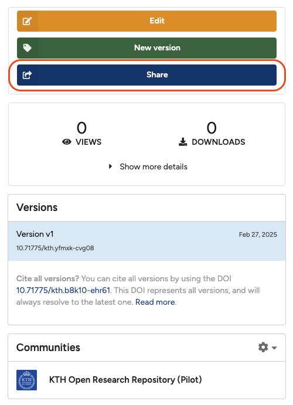

Link sharing enables you to create a secret link which provides access to your record. The link can also have an expiry date. If the person you want to share a record with already has a KTH Data Repository account, you can also use user sharing.

### Permissions

You can give the secret link one of the following three permissions:

- **Can view**: Grants access to view restricted/embargoed files of all current and future versions of a published record.
- **Can preview draft**: Grants access to view drafts (unpublished records) and restricted/embargoed files of all current and future versions of a record/draft.
- **Can edit**: Grants access to edit drafts and view restricted/embargoed files of all current and future versions of a record.

*Note: The permissions apply to all current and future versions of a record/draft.*

### Get a link

1. Go to the record you would like to share, and click the blue **Share** button.
        <figure markdown="span">
        { loading=lazy }
        <figcaption>Click the Share button</figcaption>
        </figure>
2. In the **Share access** dialog, click the **Links** tab.
3. Optionally provide a title, set an expiration date, and choose a permission for your link (see above for an explanation of permissions).
4. Click the green **Create a new link** button.
5. Click the grey **Copy link** button to copy the generated link to your clipboard.

### Delete a link

1. Find the link you want to delete in the **Links** tab in the **Share access** dialog (see above).
2. Click the **Delete** button next to the link.