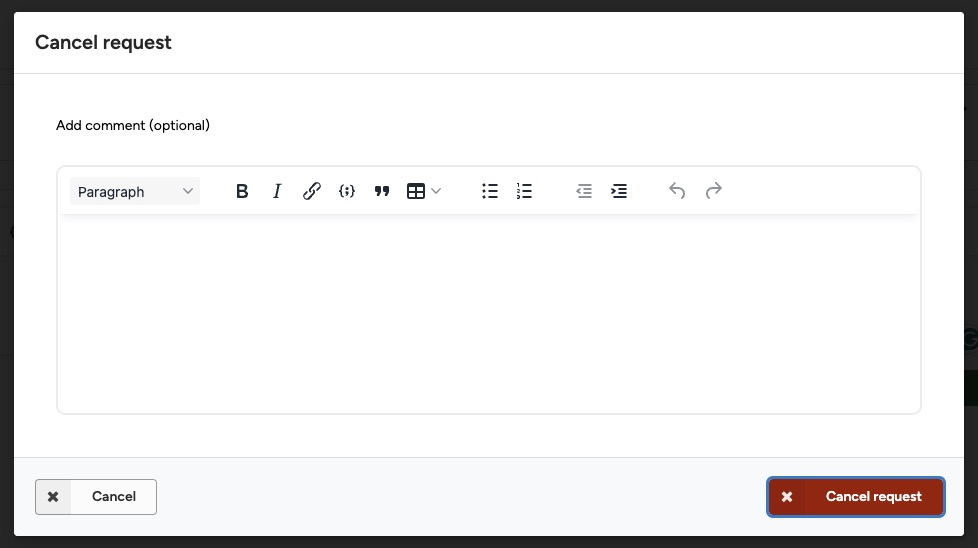
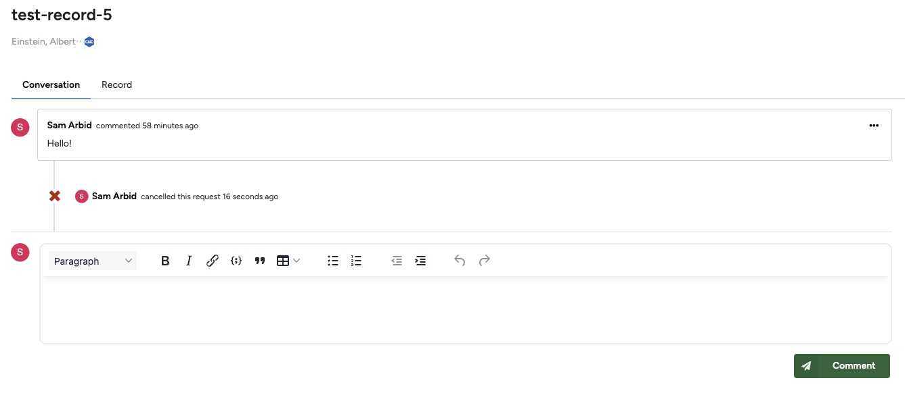
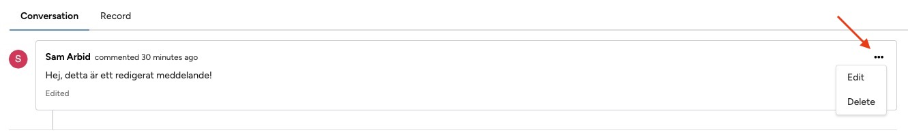
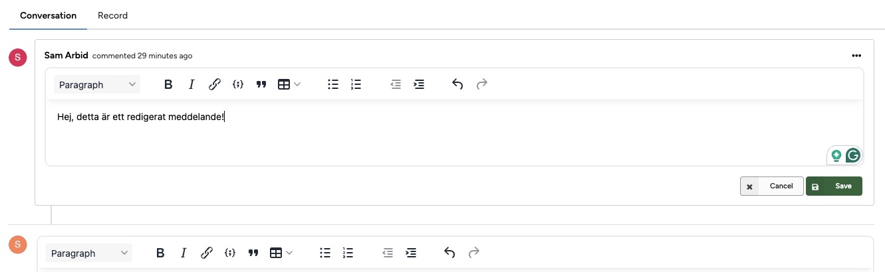
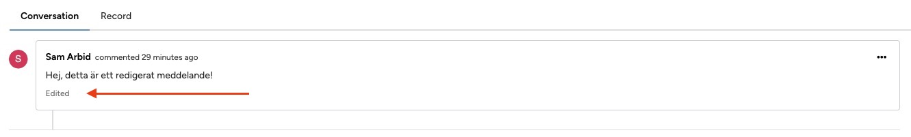
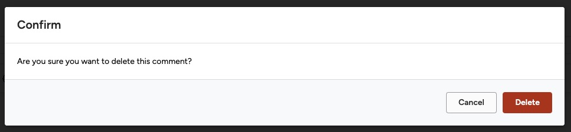
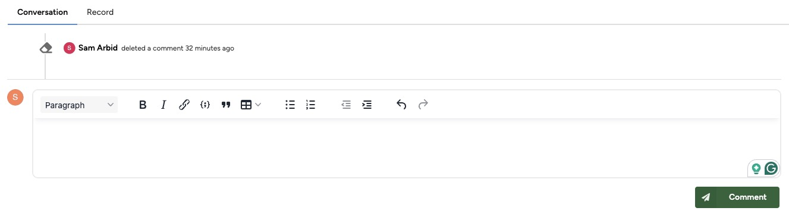

The following sections explain how you can manage your submissions, in particular:

- **View submissions** — Learn how to view records in review and find their associated review request.
- **Cancel/withdraw submission** — Learn how to withdraw a record that was submitted for review to a community.
- **Reply/edit/delete comments** — Learn how to reply to comments, as well as how to edit/delete comments.

See [Submit for review](./submit_for_review.md) and [Submit to community](./submit_to_community.md) for how to make a new submission.

In addition, see [Curate records](../communities/curate_records.md) for details on removing the record from a community once accepted, as well as how to set the branded community of the record.

## View submissions

A review request enables you to have a conversation with curators of the community as well as follow the status of the review. You can edit records in review at any time during the review process.

The following sections explain how to view your records in review and find their associated review request:

- **View records in review**
- **View review requests**

### View records in review

1. Click **My dashboard** in the header, which will open **My uploads**. Records in review are marked with an orange **"In review"** tag (see image).
        <figure markdown="span">
        { loading=lazy }
        <figcaption>In review record</figcaption>
        </figure>

2. Open the record in review. You'll notice that the community management buttons and submit buttons have been disabled. Click **View request** to access the review request.
        <figure markdown="span">
        { loading=lazy }
        <figcaption>Review button</figcaption>
        </figure>

### View review requests

1. Click **My dashboard** in the header, and then click **My requests**. By default, all open review requests are displayed. Click the **Closed** button to show closed requests.
        <figure markdown="span">
        { loading=lazy }
        <figcaption>Open requests page</figcaption>
        </figure>
2. Open the review request to view the conversation history.
        <figure markdown="span">
        { loading=lazy }
        <figcaption>Request conversation</figcaption>
        </figure>
3. Click the **Record** tab to see a preview of the record.
        <figure markdown="span">
        { loading=lazy }
        <figcaption>Record preview page</figcaption>
        </figure>

## Cancel/Withdraw Submission

You can cancel a review request at any point in the review process.

### Cancel a Submission (Withdraw)

1. Go to the review request (see [View Submissions](#view-submissions)).
        <figure markdown="span">
        { loading=lazy }
        <figcaption>Record preview page</figcaption>
        </figure>
2. Click the **Cancel** button in the top right corner.
3. (Optional) Leave a message for the curators and confirm the cancellation by clicking **Cancel request**.
        <figure markdown="span">
        { loading=lazy }
        <figcaption>Cancel Request</figcaption>
        </figure>
4. The request timeline will update to show that the request was cancelled. The community curators will no longer be able to view your record.
        <figure markdown="span">
        { loading=lazy }
        <figcaption>Record preview page</figcaption>
        </figure>

## Reply, Edit, or Delete Comments

A review request allows for communication between the uploader and community curators. You will receive email notifications for new comments if you have enabled notifications.

### Reply to a Comment

1. Go to the review request (see **View Submissions**).
2. Write a comment in the comment field. You may use basic formatting.
      <figure markdown="span">
      { loading=lazy }
      <figcaption>Conversation window</figcaption>
      </figure>
3. Submit the comment by clicking the green **Comment** button.

### Edit a Comment

1. Find the comment you want to edit and click the three dots (**...**) in the top right corner of the comment.
2. Click **Edit** in the dropdown menu.
      <figure markdown="span">
      { loading=lazy }
      <figcaption>Conversation edit input</figcaption>
      </figure>
3. Edit your comment. Once ready, click the green **Save** button.
      <figure markdown="span">
      { loading=lazy }
      <figcaption>Conversation marked as edited</figcaption>
      </figure>
4. The comment will show that it was edited.
      <figure markdown="span">
      { loading=lazy }
      <figcaption>Conversation marked as edited</figcaption>
      </figure>
### Delete a Comment

1. Find the comment you want to delete and click the three dots (**...**) in the top right corner of the comment.
2. Click **Delete** in the dropdown menu.
      <figure markdown="span">
      { loading=lazy }
      <figcaption>Conversation delete button</figcaption>
      </figure>
3. Confirm that you want to delete the comment by clicking the red **Delete** button.
      <figure markdown="span">
      { loading=lazy }
      <figcaption>Conversation confirm delete</figcaption>
      </figure>
4. The timeline will indicate that a comment was deleted.
      <figure markdown="span">
      { loading=lazy }
      <figcaption>Selected chat deleted</figcaption>
      </figure>