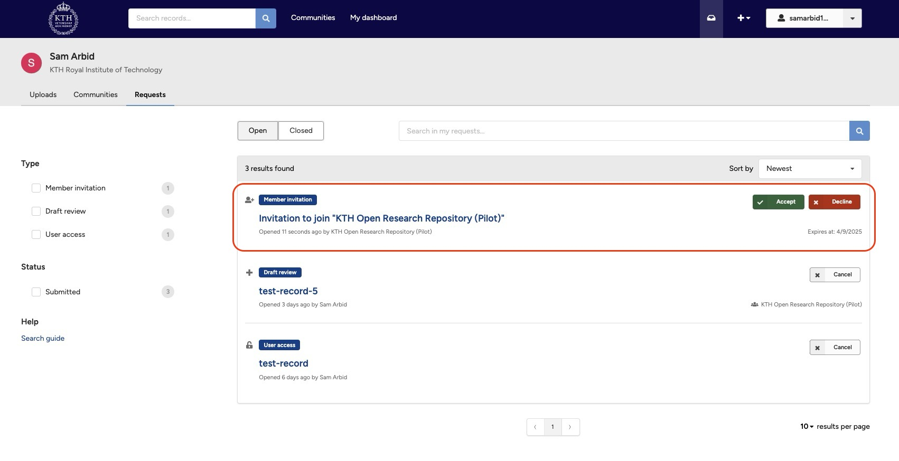
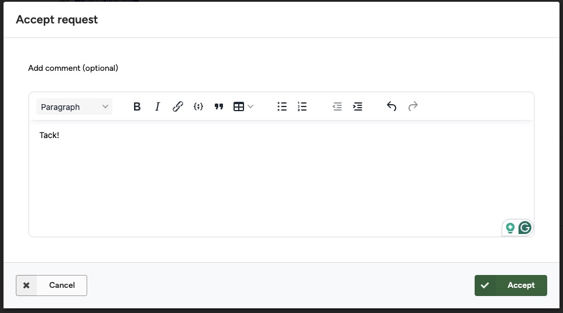
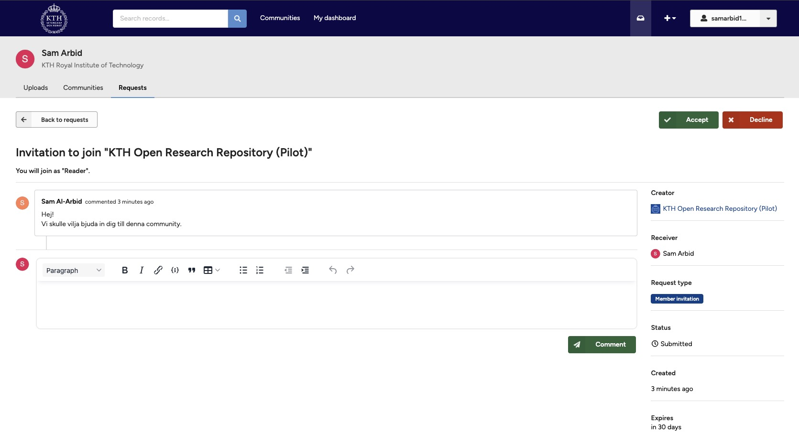

Community managers can invite you to join a community as a member. It is not yet possible for you to request to join a community.

### Accept/decline an invitation

1. Go to **My requests**, where you will find the invitation (click **My dashboard** in the header, and then **My requests** in the tab menu).
      <figure markdown="span">
      { loading=lazy }
      <figcaption>Community invitation</figcaption>
      </figure>
2. Click **Accept** or **Decline** directly on the invitation, confirm your choice in the dialog, and optionally provide a message to the community managers.
      <figure markdown="span">
      { loading=lazy }
      <figcaption>Accept invitation</figcaption>
      </figure>
3. Click the invitation request to see details about the request and have a conversation with the community managers.
      <figure markdown="span">
      { loading=lazy }
      <figcaption>Community invitation</figcaption>
      </figure>