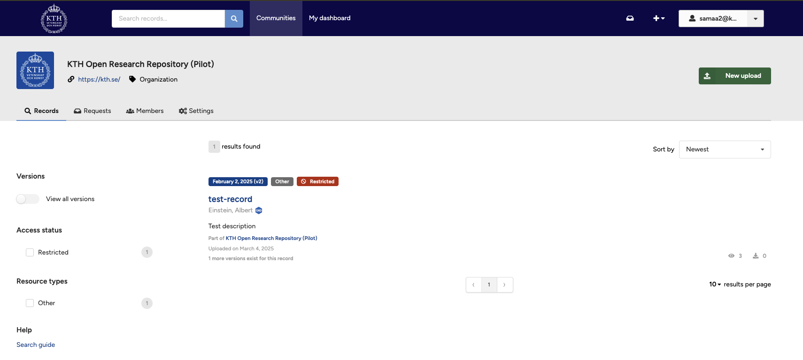
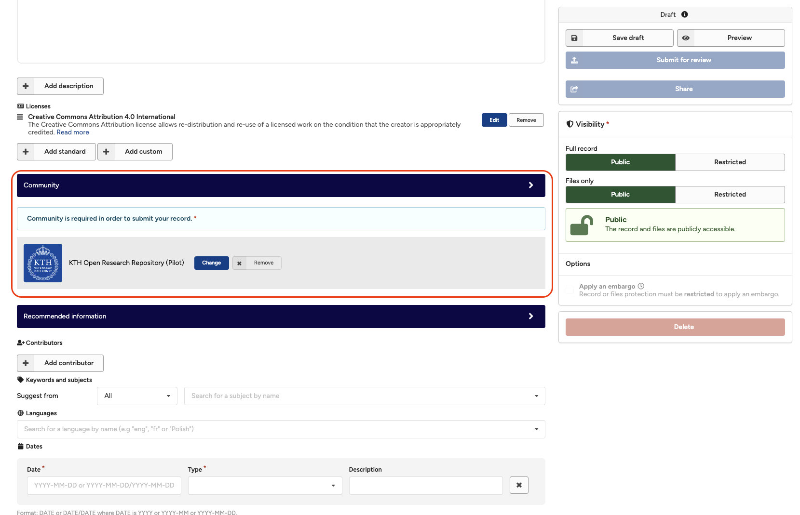
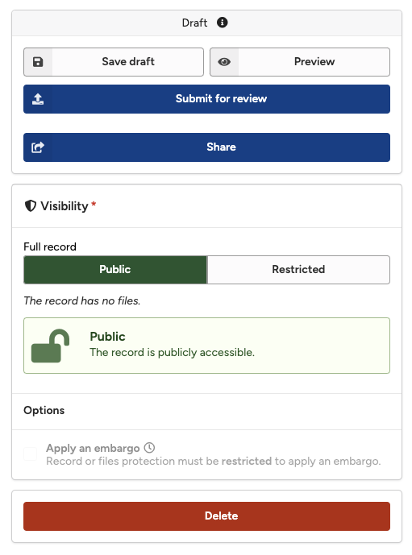
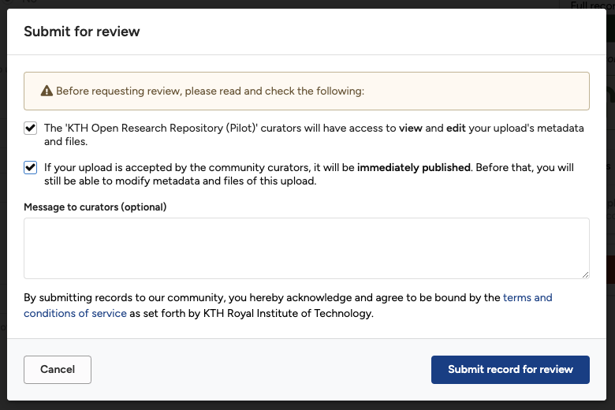
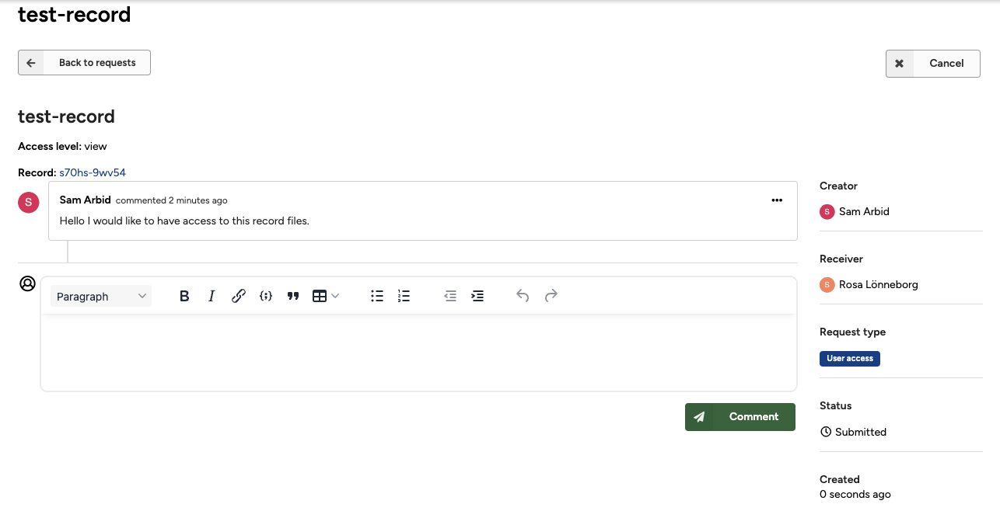

Want to test KTH Data Repository? Use our sandbox environment on [https://sandbox.datarepository.kth.se](https://sandbox.datarepository.kth.se) to play.

The following section explains how you submit an unpublished record to a community for review.

### Only drafts

You can only submit drafts (i.e. unpublished records) to a community (see [submit to community](submit_to_community.md) for submitting published records).

### Both uploader and curators can edit

Both you as the uploader and the curators of the community can edit the metadata and files of the draft when you submit it for review.

### Published when accepted

The record is automatically published when the curator(s) of the community accept your record into the community. If the review is declined, you can choose to submit the record to a new community.

## Submit your record for review in 3 simple steps:

### Step 1: Find a community

First, find the community you would like to submit your record to for review.

1. Click **Communities** menu item in the header.
        <figure markdown="span">
        { loading=lazy }
        <figcaption>Communities page</figcaption>
        </figure>
2. Search for a community and go to the community front page.
3. Click the **New upload** button on the community page.
4. Verify that your selected community is now displayed in the community section of the deposit form.
        <figure markdown="span">
        { loading=lazy }
        <figcaption>Selected community</figcaption>
        </figure>
5. You can at any point change the community by pressing the **Change** or **Remove** button.

### Step 2: Submit for review

1. Upload files and describe the record as explained in the deposit section.
2. When ready, click the blue **Submit for review** button.
        <figure markdown="span">
        { loading=lazy }
        <figcaption>Submit for review</figcaption>
        </figure>
3. Confirm that you want to submit for review by:
   - Ticking the checkbox that curators of the community can view and edit the record.
   - Ticking the checkbox that the record is published immediately when the curator accepts the record.
   - Optionally providing a message to the curator.
   - Finally, clicking the **Submit record for review** button.
        <figure markdown="span">
        { loading=lazy }
        <figcaption>Accept the terms and services</figcaption>
        </figure>
4. Once submitted, you will be redirected to the review request page.
        <figure markdown="span">
        { loading=lazy }
        <figcaption>Request page</figcaption>
        </figure>

### Step 3: Manage submission

See [manage your submissions](./manage_submissions.md) for details on how to manage your submission.
