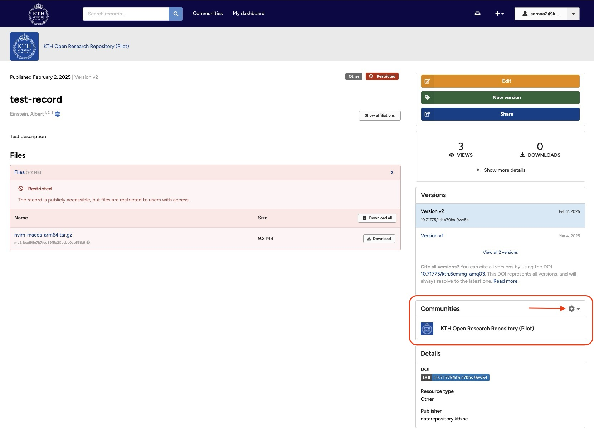
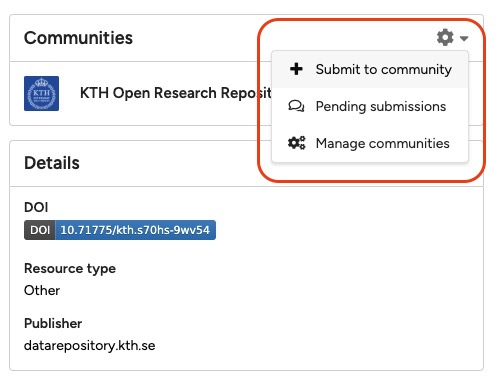
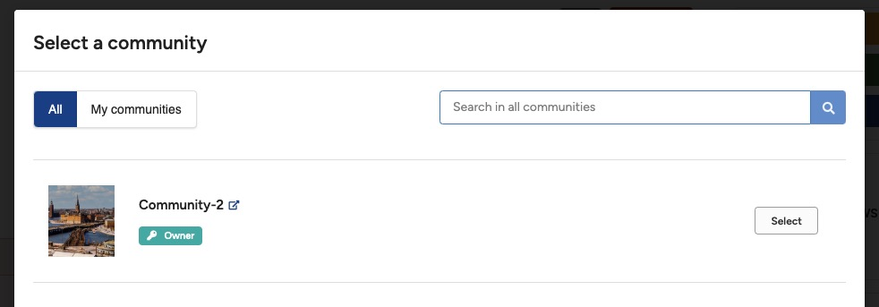
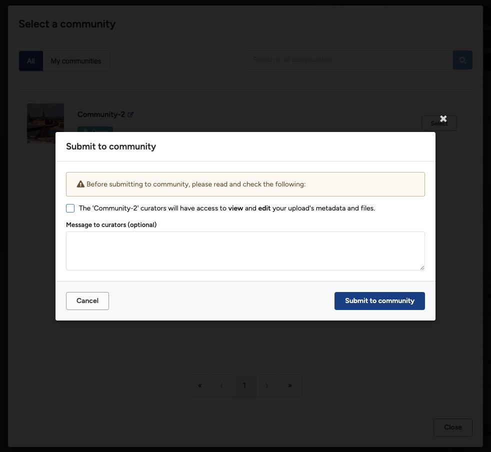

Want to test KTH Data Repository? Use our sandbox environment on [https://sandbox.datarepository.kth.se](https://sandbox.datarepository.kth.se){:target="_blank"} to play.

The following section explains how you submit a published record to a community for inclusion.

## Only published records

You can only submit published records for inclusion in a community (see [Submit for review](submit_for_review.md) for submitting an unpublished record to a community).

## Both uploader and curators can edit

Both you as the uploader and the curators of the community can edit the metadata when you submit it to a community.

Learn below how to:

- [Submit to community](#submit-to-community)
- [View pending submission](#view-pending-submission)

**Note:** We do not support submitting a record to multiple communities in one go. Instead, simply repeat the process described below.

## Submit to community

### 1. Open the communities menu

Go to the record you want to submit to a community and click the cogwheel icon to open the communities menu.
        <figure markdown="span">
        { loading=lazy }
        <figcaption> Submit to community</figcaption>
        </figure>

### 2. Select "Submit to community"

Click **Submit to community** in the dropdown menu.
        <figure markdown="span">
        { loading=lazy }
        <figcaption>Submit to community menu</figcaption>
        </figure>

### 3. Choose the community

Find the community you want to submit to and click the **Select** button.
        <figure markdown="span">
        { loading=lazy }
        <figcaption>Find a community menu</figcaption>
        </figure>
### 4. Confirm submission

Confirm you want to submit the record to the community by:

- Ticking the checkbox that allows curators to view and edit your record.
- Optionally, writing a message to the curators.
- Finally, clicking the blue **Submit to community** button.
        <figure markdown="span">
        { loading=lazy }
        <figcaption>Find a community menu</figcaption>
        </figure>

## View pending submission

### 1. Access pending submissions

Click **Pending submissions** in the community dropdown menu from the record landing page.
        <figure markdown="span">
        { loading=lazy }
        <figcaption>Pending communities menu</figcaption>
        </figure>

### 2. Open the access request

Click the community title to view the access request.

### 3. Interact with curators

The access request allows you to have a conversation with the community curators. See also [Manage submission](./manage_submissions.md) for further details.
        <figure markdown="span">
        { loading=lazy }
        <figcaption>Pending communities menu</figcaption>
        </figure>
