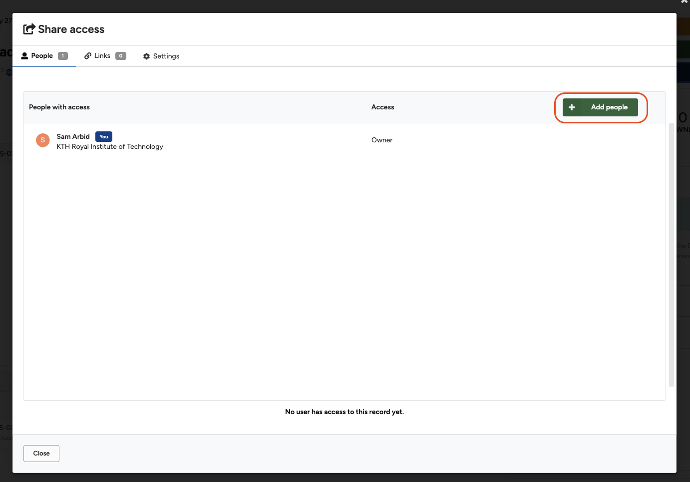
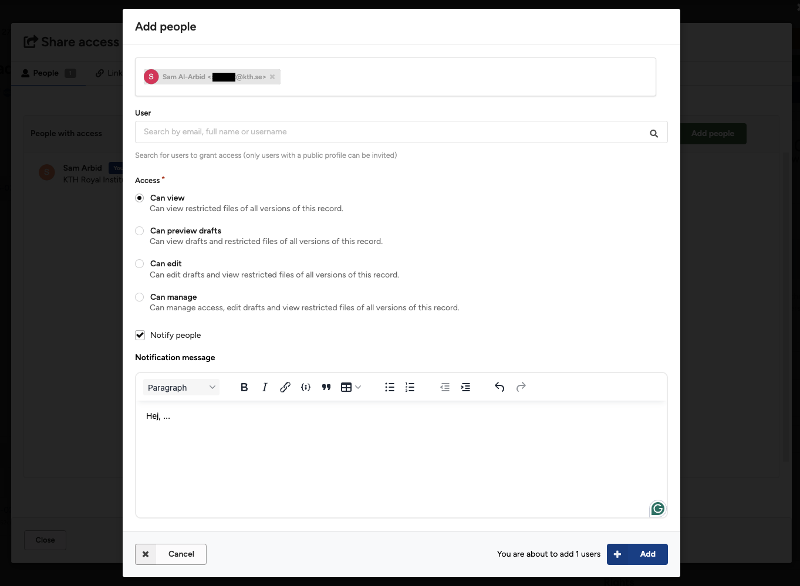
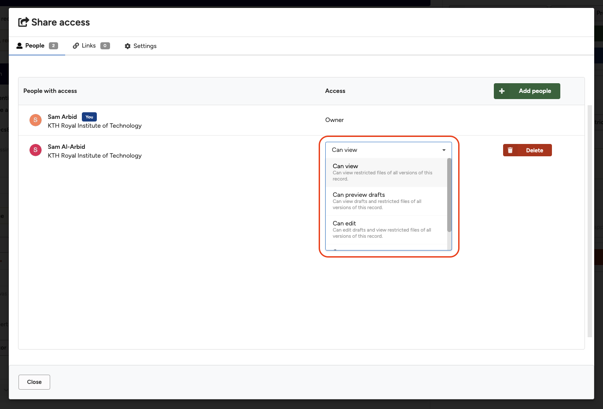

User sharing enables you to share a draft or record with another KTH Data Repository user. If the person you want to share a record with does not have a KTH Data Repository account, you can instead use [link sharing](./link_sharing.md).

### Permissions

You can grant one or more users one of the following four permissions:

- **Can view** – Grants access to view restricted/embargoed files of all current and future versions of a published record.
- **Can preview drafts** – Grants access to view drafts (unpublished records) and restricted/embargoed files of all current and future versions of a record/draft.
- **Can edit** – Grants access to edit drafts and view restricted/embargoed files of all current and future versions of a record.
- **Can manage** – Grants access to manage access, edit drafts, and view restricted/embargoed files of all current and future versions of a record.

> **Note:** The permissions apply to all current and future versions of a record.

### Overview

- [Share a record](#share-a-record)
- [Share a draft](#share-a-draft)
- [Change permission for a user](#change-permission-for-a-user)
- [Remove a user](#remove-a-user)

### Share a Record

1. Go to the record you would like to share and click the blue **Share** button.
      <figure markdown="span">
      { loading=lazy }
      <figcaption>Click the Share button</figcaption>
      </figure>
2. Click the green **Add people** button in the **Share access** dialog under the **People** tab.
      <figure markdown="span">
      { loading=lazy }
      <figcaption>Click the Add people button</figcaption>
      </figure>
3. In the **Add people** dialog, use the **User** field to search for one or more users by name, username, or email address.
   > **Note:** Only users who have public profile visibility can be found and added.
      <figure markdown="span">
      { loading=lazy }
      <figcaption>Use the User field to search for users</figcaption>
      </figure>
4. Under **Access**, select the permission you would like to grant the selected users.
5. Choose if you want to notify the users and optionally write a message to them.
6. Click the blue **Add** button to grant the users access.

### Share a Draft

1. From the upload form, click the blue **Share** button.
   > **Note:** You must save and provide minimal metadata for the button to become enabled.
2. Follow the [Share a Record](#share-a-record) instructions from step 2.
3. To share a draft (unpublished record), you must grant one of the following permissions:
   - **Can preview drafts**
   - **Can edit**
   - **Can manage**

### Change Permission for a User

1. Open the **Share access** dialog (see [Share a Record](#share-a-record) and [Share a Draft](#share-a-draft)).
2. Click the drop-down menu in the **Access** column and choose a new permission.
3. Once the change has been saved, it will be confirmed with a small green tick mark.
      <figure markdown="span">
      { loading=lazy }
      <figcaption>Use the Access column to change permissions</figcaption>
      </figure>

### Remove a User

1. Open the **Share access** dialog (see [Share a Record](#share-a-record) and [Share a Draft](#share-a-draft)).
2. Click the red **Delete** button next to the user you want to remove access from.
